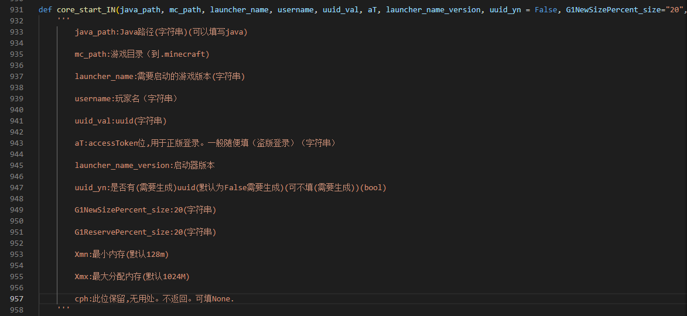

# core_start.py使用说明

## 简介

在这个版本中，有三个最重要的函数。core_start_IN、core_start_Login、core_bootstrap_main。


core_start_IN 是启动部分，可以启动minecraft.

core_start_Login 是正版登录部分，用来获取正版登录的令牌和更新令牌。

（用于初次登录MS账号，以后加入令牌刷新部分）

core_bootstrap_main 是文件补全部分

## 关于core_bootstrap_main的调用

我们不难发现有以下几个参数

```selfup, mc_path, jar_version, link_type```

```selfup```: 该参数 **保留** ，固定为 ```True```。 **必填**

```mc_path```: 该参数的**作用**为 指定```minecraft```根目录位置，也就是```.minecraft```文件夹所在位置的**绝对**路径。 **必填**

><small>~~(当然这只是建议,如果你觉得相对路径在该环境下能够使用的话你也可以用相对路径，但这并没有经过**完全**的测试)~~</small>

```jar_version```: 该参数的**作用**为 指定要下载、更新或补全的```minecraft```版本，**必填**

```link_type```: 该参数的**作用**为 指定下载或补全时使用的源。可选的有```mojang```、```BMCLAPI```和 ~~```MCBBS```~~

><small>~~```MCBBS```源目前似乎已经成为了时代的眼泪，总之```MCBBS```源选项已被弃用，如果选择该参数将无法正常补全，并且可能会导致未定义行为~~</small>

| 参数名 | 参数作用 | 参数状态 | 其他 |
|-------|----------|---------|------|
| selfup | 保留，值应为```True``` | 保留 | **必填** |
| mc_path | 指定```minecraft```根目录位置，也就是```.minecraft```文件夹所在位置的**绝对**路径 | 正在使用 | **必填** |
| jar_version | 指定要下载、更新或补全的```minecraft```版本 | 正在使用 | **必填** |
| link_type | 指定下载或补全时使用的源。可选的有```mojang```、```BMCLAPI```和 ~~```MCBBS```~~ | 正在使用 | **必填** |


## 关于core_start_IN的调用

首先根据文档



最全的调用看起来应该是这样的

> core_start_IN("java", 路径: str, "1.12.2", username: str, uuid_val, accessToken: str, 启动器版本号: str, 是否需要生成uuid, "20", "20", "128M", "2048M", None)

(java_path)"java" 这个位置应该填写到java.exe，如果填写"java"应确认环境变量里有 **生效** 的配置 比如像 "E:\java\bin" 这样的配置。

(mc_path)路径应该像这样 "L:\\smcl\\formal\\tools\\.minecraft"

(launcher_name)"1.12.2" 这个位置应该填写有效的版本号

username 应该填写像"Player"这样的用户名

uuid_val 填写的内容在是否需要生成uuid位为True将会被使用，如果为False将不会被使用。str

accessToken 在离线登录模式下可以随便填写

(launcher_name_version)启动器版本号填写的应该是启动器的版本

(uuid_yn)是否需要生成uuid位 应该填写布尔值（bool)如果为False，将会返回一个带有uuid的列表。为True将会使用uuid_val填写的内容

G1NewSizePercent_size:20(字符串)(可不填）

G1ReservePercent_size:20(字符串)(可不填）

Xmn:最小内存(默认128m)(可不填）

Xmx:最大分配内存(默认1024M)（可不填）

cph:此位保留,无用处。不返回。可填None.（可不填）